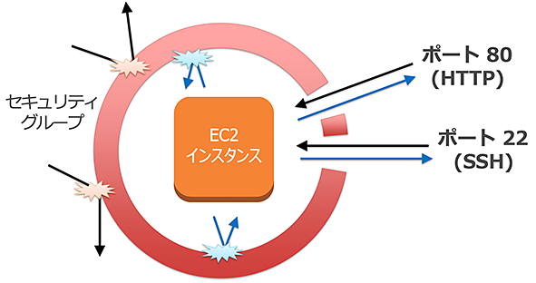
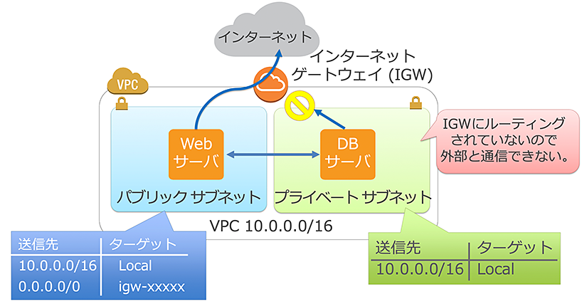
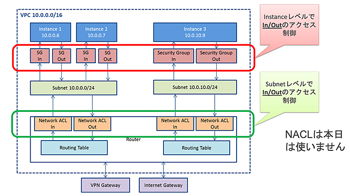
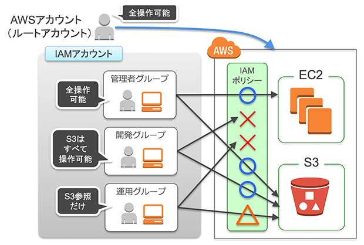
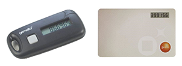
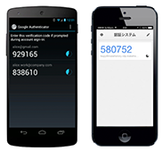

author: Kohei Otani
summary: AWS 体験ハンズオン〜セキュア&スケーラブルウェブサービス構築
id: awshandson20220329
categories: aws,handson,markdown
environments: Web
status: Making
feedback link: https://github.com/otanikohei/Amazon-VPC---Amazon-EC2---Amazon-RDS-Handson
analytics account: 

# AWS 体験ハンズオン〜セキュア&スケーラブルウェブサービス構築

## はじめに
Duration: 0:05:00

Amazon Web Services (AWS) を利用して、セキュアでスケーラブルなウェブサービスの構築手順を体験できるハンズオンを実施いたします。  
AWS を使ってより安全にサービスを運用する方法、ウェブサービスの規模に合わせて、柔軟にシステムを拡張する方法を体験できる内容です。  
本ハンズオンのドキュメントで掲載されているスクリーンキャプチャは 2022年03月時点のもので、現在の画面とは異なる場合がございます。予めご了承ください。

### 【準備事項】
- AWS を利用可能なネットワークに接続された PC (Windows, Mac OS, Linux等)
- 事前に用意していただいた AWS アカウント
- SSH クライアント (Windows 環境では Teraterm を推奨)
- ブラウザ (Firefox もしくは Chrome を推奨)

## 座学

### AWS のセキュリティやスケーラビリティを 高める機能・サービス

- **セキュリティグループ** = ファイアウォール
- **Amazon VPC** = プライベートな仮想ネットワーク
- **AWS IAM** = AWS リソースへのアクセス権限の管理

## 1.セキュリティグループ
インターネットからのトラフィック (インバウンド) をブロックするだけでなく、Amazon EC2 インスタンスからのトラフィック (アウトバウンド) も制限できるファイアウォール機能です。

個々のインスタンスごとに、インバウンド、アウトバウンドに対して下記の許可ルールを定義できます。  
ルールはステートフルで扱われ、明示ルールが無い通信は拒否されます。

- インバウンド
  - プロトコル (TCP/UDP/ICMP)
  - ポート範囲 (ポート番号の範囲)
  - 送信元 (アクセス元のIPアドレス)
- アウトバウンド
  - プロトコル (TCP/UDP/ICMP)
  - ポート範囲 (ポート番号の範囲)
  - 送信先 (アクセス先のIPアドレス)

## 2. Amazon VPC (Virtual Private Cloud)

クラウド内にお客様専用の **プライベートアドレス** の空間を構築します。  
社内ネットワークとインターネット VPN やキャリアの閉域網で接続できます。

#### VPC とサブネットについて

1 つの VPC は、1 つのネットワークアドレス (CIDR) で定義します。  
1 つの VPC 内には複数のサブネットを作成することができます。  
サブネットは特定のアベイラビリティゾーン内に配置します。

|  CIDR  |  IP アドレス数  |
| :----------: | :--------: |
|  xxx.xxx.xxx.xxx/16  |  65,531  |
|  xxx.xxx.xxx.xxx/20  |  4,091  |
|  xxx.xxx.xxx.xxx/24  |  251  |
|  xxx.xxx.xxx.xxx/28  |  11  |

各サブネットにおいて先頭の 4 IP アドレスと最後の 11 IP アドレスは AWS 側で確保されます。

#### ルートテーブルについて

各サブネットはルートテーブルを持っています。  
設定を変更することでデータの流れを制御可能です。

- パブリックサブネット
 ルートテーブル: rtb-XXXXXXXX
 
 | 送信先 | ターゲット |
 | ----- | ----- |
 | 10.0.0.0/16 | local |
 | 0.0.0.0/0 | igw-XXXXXXXX |
 
 IGW (インターネット ゲートウェイ) へのルーティングを設定すると、外部とのアクセスが可能になります。
 
- プライベートサブネット
 ルートテーブル: rtb-XXXXXXXX
 
 | 送信先 | ターゲット |
 | ----- | ----- |
 | 10.0.0.0/16 | local |

 

#### VPC でのセキュリティーグループと NACL

#### NACL (Network Access Control List)

- 個々の Subnet ごとにアクセス制御が可能
- Inbound, Outbound に対して下記の設定が可能
  - Inbound
    - Port range (ポート番号)
    - Source (アクセス元IPアドレス)
    - Allow/Deny
  - Outbound
    - Port range (ポート番号)
    - Destination (アクセス先IPアドレス)
    - Allow/Deny

制御可能な項目はセキュリティーグループと同じで、ステートフル(SG)かステートレス(NACL)かの違いがあります。  
NACL は本日は使いません。

## 3. AWS IAM (Identity and Access Management)
AWS操作をよりセキュアに行うための認証・認可の仕組み  
AWS利用者の認証とアクセスポリシーを管理 • グループ、ユーザー、ロールで管理

- 実行出来る操作を IAM ポリシー規定 • ユーザーごとに認証情報の設定が可能
  - マネージメントコンソールにはユーザ名とパスワードを使用 さらに、MFA(多要素認証) の利用が推奨
  - API にはアクセスキーとシークレットキーを使用

### IAM ポリシーで必要最小限のみ付与

### 備考: MFA (多要素認証) で認証の安全性を高める

- AWS アカウント (ルートアカウント) • ハードウェアトークンで保護
  - トークンは金庫などで管理  
  
- IAMアカウント
  - 個人ごとのアカウント
  - 仮想 MFA 対応のスマホアプリで保護  
  

